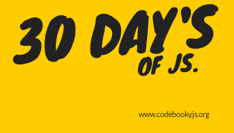

<h1 align="center">
  30daysofjs
</h1>

  Working on small projects everyday to refine my knowledge of javascript . 💯💯
   
  Code Daily, add your solutions to the given problem, submit a PR (and don't forget to add your name in the contributors list)

***

      

## Want To Be a Contributor?

## Code Today!

Create different Projects daily using JavaScript.
